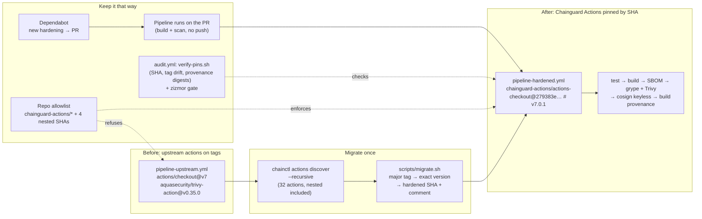

# Chainguard Actions, end to end

One CI pipeline, built twice. [`pipeline-upstream.yml`](.github/workflows/pipeline-upstream.yml) uses 14 popular
GitHub Actions the way most repositories do: by tag. [`pipeline-hardened.yml`](.github/workflows/pipeline-hardened.yml)
is the same file after migration to [Chainguard Actions](https://edu.chainguard.dev/chainguard/actions/overview/),
hardened drop-in replacements pinned by commit SHA. Only the `uses:` lines differ. Both test, build, generate an SBOM,
scan with grype and Trivy, sign keyless with cosign, and publish GitHub build provenance for a small Go service on a
Chainguard image.

Everything was run for real on 6 and 7 October 2026, the day Chainguard Actions became generally available.
**[FINDINGS.md](FINDINGS.md)** has the eleven results with evidence. The headline:

- **The migration is mechanical, not a rename.** 9 of the 12 major tags these actions publish (`@v7`, `@v4`) have no
  hardened equivalent; [`scripts/migrate.sh`](scripts/migrate.sh) resolves each to the exact hardened version in seconds.
- **Most of the protection is where the code lives.** 5 of 14 hardened actions run upstream's code unchanged and 3
  carry real fixes, but all 14 are immutable, reviewed copies of the exact upstream commit. The attacks on
  `tj-actions/changed-files` (2025) and `aquasecurity/trivy-action` (March 2026) moved tags; a SHA-pinned hardened
  copy is immune to both.
- **Three things need a decision:** nested upstream actions an allowlist must name (4 here), binaries actions download
  while they run, and a usage hook that reports to Chainguard.
- **No measurable cost:** 221 s against 228 s per run, both images with 0 findings, zizmor high findings 16 to 0.

## How it fits together



## Results at a glance

| | Upstream pipeline | Hardened pipeline |
|---|---|---|
| Action references | 16 `uses:` on tags | 16 `uses:` on commit SHAs, version as a comment |
| zizmor (workflow analysis) | 16 high: `unpinned-uses` | No findings |
| Run time, mean of three runs on `main` | 221 s | 228 s |
| Image scan, grype and Trivy | 0 findings | 0 findings |
| Signed keyless, verified | yes | yes |
| Repository allowlist on | refused before start | passes with 4 nested upstream SHAs allowed |
| Tag hijack of an upstream action | runs whatever the tag points to | not affected: the SHA names a Chainguard-built copy |

Runs: [upstream](https://github.com/sathpal/chainguard-actions-end-to-end/actions/runs/37510147638) ·
[hardened](https://github.com/sathpal/chainguard-actions-end-to-end/actions/runs/37510147374) ·
[audit](https://github.com/sathpal/chainguard-actions-end-to-end/actions/runs/37510147115) ·
[Dependabot PR #1](https://github.com/sathpal/chainguard-actions-end-to-end/pull/1) ·
[hardened under the allowlist](https://github.com/sathpal/chainguard-actions-end-to-end/actions/runs/37512719340).
The upstream workflow is disabled now: with the allowlist on it cannot start, which is the point.

## Use it on your own repository

You need `git`, `jq` and `curl`; `gh` for the survey; `chainctl` for discovery (no Chainguard login needed).

```bash
# 1. Everything your workflows run, nested actions included
chainctl actions discover <owner>/<repo> --recursive

# 2. Rewrite a workflow to Chainguard Actions; the report goes to stderr
scripts/migrate.sh .github/workflows/ci.yml > ci.hardened.yml

# 3. Check the pins: SHA, whether the tag has moved since, provenance digests of every file
scripts/verify-pins.sh ci.hardened.yml

# 4. What did hardening change in the code that runs?
scripts/diff-upstream.sh sigstore/cosign-installer v4.1.2

# 5. Latest upstream release against the latest hardened one, hook, provenance, findings
scripts/survey.sh actions/checkout docker/build-push-action

# 6. Upstream actions still nested inside hardened ones, and the allowlist patterns they need
scripts/nested.sh ci.hardened.yml

# 7. Six PASS/FAIL checks for a migrated workflow, for your own CI
scripts/acceptance.sh ci.hardened.yml
```

Then add [`.github/dependabot.yml`](.github/dependabot.yml) for `github-actions`, run your pipeline on pull requests,
and restrict allowed actions (Settings > Actions > General) to `chainguard-actions/*` plus the nested upstream SHAs from
step 6.

## What is here

| Path | What it is |
|---|---|
| [`app/`](app), [`Dockerfile`](Dockerfile) | A small Go service; built on `cgr.dev/chainguard/go`, runs on `cgr.dev/chainguard/static` as UID 65532, both by digest |
| [`.github/workflows/pipeline-upstream.yml`](.github/workflows/pipeline-upstream.yml) | Before: upstream actions on tags (disabled: the allowlist refuses it) |
| [`.github/workflows/pipeline-hardened.yml`](.github/workflows/pipeline-hardened.yml) | After: generated once by `scripts/regen-hardened.sh`, then maintained by Dependabot |
| [`.github/workflows/audit.yml`](.github/workflows/audit.yml) | Pins, tag drift, provenance digests, and zizmor, on every workflow change and weekly |
| [`.github/dependabot.yml`](.github/dependabot.yml) | Weekly grouped updates for actions and base images |
| [`.chainguard/actions.yaml`](.chainguard/actions.yaml) | Configuration for Chainguard's Guardener app; inert until the app is installed |
| [`scripts/`](scripts) | `migrate.sh`, `regen-hardened.sh`, `verify-pins.sh`, `nested.sh`, `acceptance.sh`, `diff-upstream.sh`, `survey.sh` |
| [`evidence/`](evidence) | Raw outputs behind every number in FINDINGS.md |

## Verify the images yourself

The package is public. Take a digest from the [package page](https://github.com/sathpal/chainguard-actions-end-to-end/pkgs/container/chainguard-actions-end-to-end%2Fhello)
or a hardened run's log, then:

```bash
IMG=ghcr.io/sathpal/chainguard-actions-end-to-end/hello@<digest>
cosign verify "$IMG" \
  --certificate-identity https://github.com/sathpal/chainguard-actions-end-to-end/.github/workflows/pipeline-hardened.yml@refs/heads/main \
  --certificate-oidc-issuer https://token.actions.githubusercontent.com
gh attestation verify "oci://$IMG" -R sathpal/chainguard-actions-end-to-end
```

## References

- [Chainguard Actions overview](https://edu.chainguard.dev/chainguard/actions/overview/) and
  [telemetry and privacy](https://edu.chainguard.dev/chainguard/actions/telemetry/)
- [The catalog on GitHub](https://github.com/chainguard-actions) (1,173 repositories on 6 October 2026)
- [Trivy supply chain attack: what you need to know](https://www.aquasec.com/blog/trivy-supply-chain-attack-what-you-need-to-know) (Aqua)
- [CVE-2025-30066, tj-actions/changed-files](https://github.com/advisories/GHSA-mrrh-fwg8-r2c3)
- [zizmor](https://docs.zizmor.sh/) for analysing your own workflows

Chainguard Actions is a Chainguard product; this repository is an independent evaluation of it.
